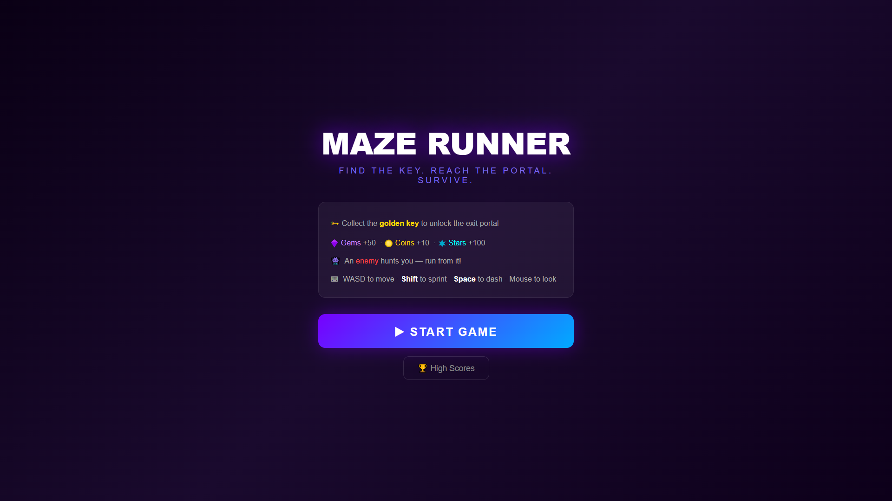
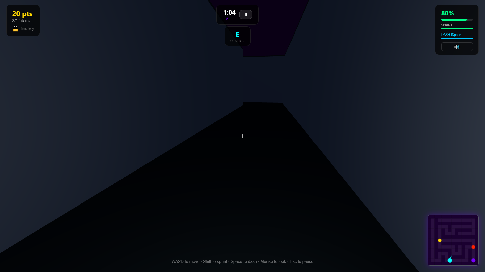
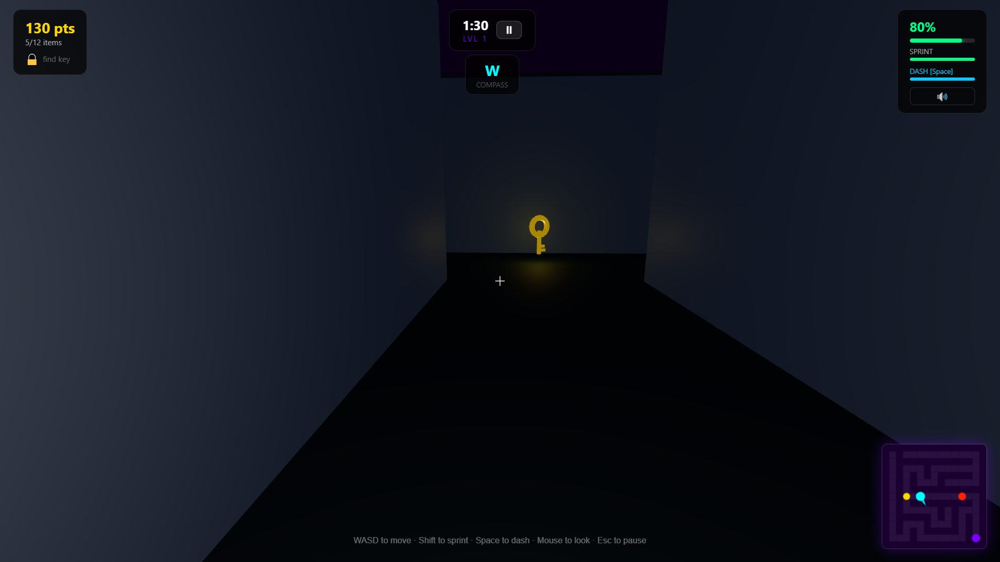
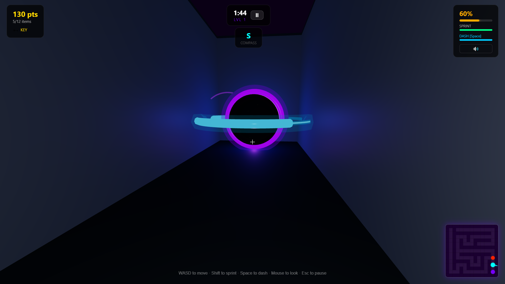
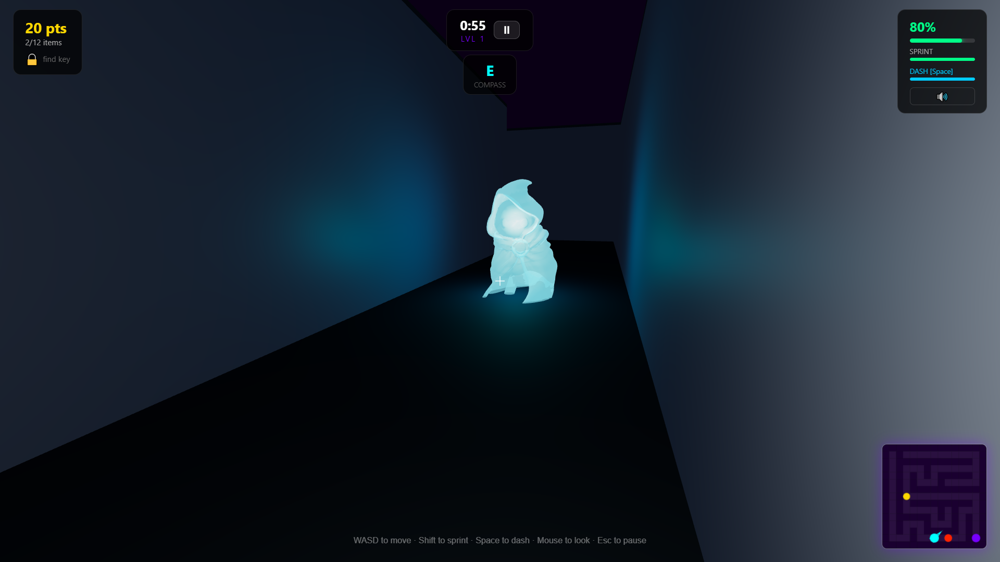
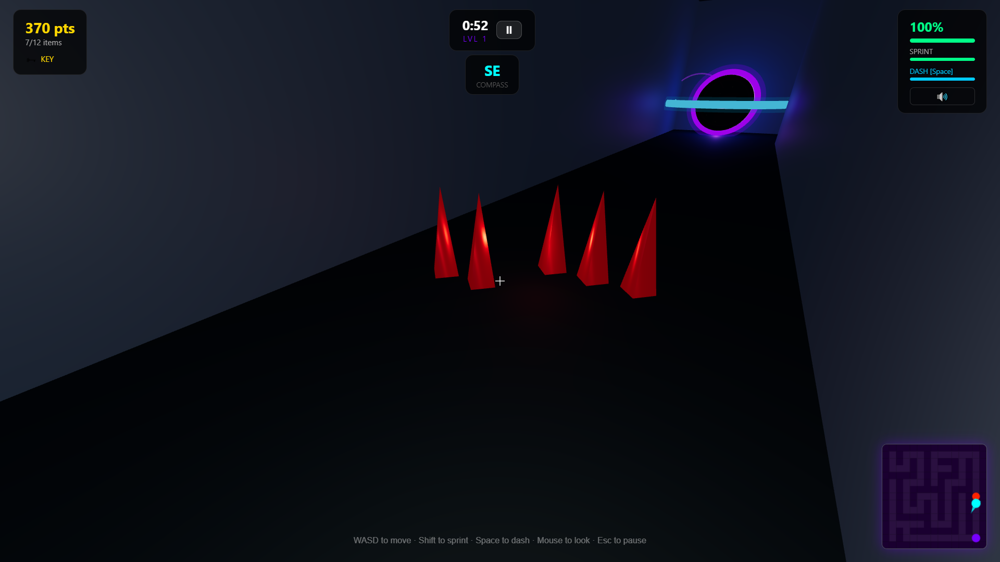
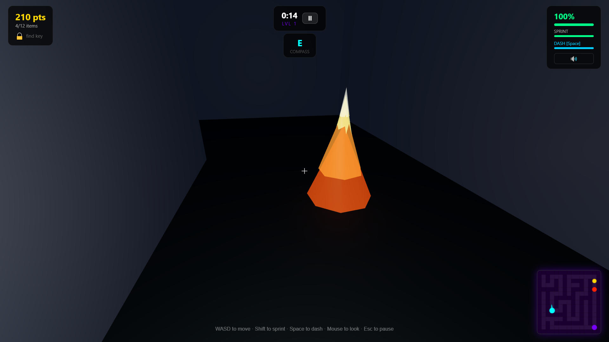
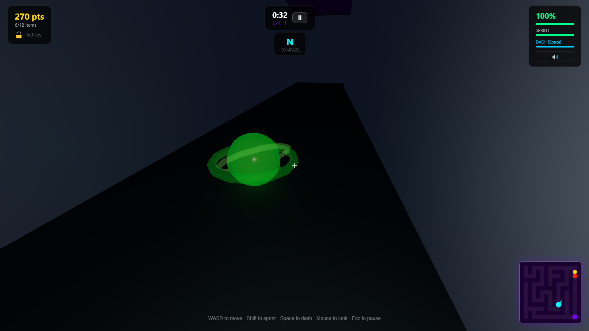
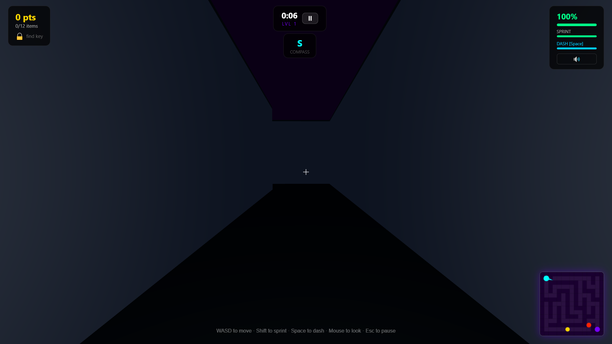

# 🌀 Maze Explorer 3D

A first-person 3D maze game built with React, Three.js, and React Three Fiber. Navigate dark, atmospheric mazes, collect items, avoid a haunting ghost enemy, and find the exit before it finds you.

[](https://maze-game-3d.netlify.app)
[](https://github.com/jarquecarl-debug/maze-game)


---

## Screenshots

### 🏠 Homepage


### 🎮 Gameplay


### 🗝️ Key Item


### 🌀 Exit Portal


### 👻 Wraith Enemy


### 🔴 Red Crystal Spikes


### 🔥 Fire Obstacle


### ☠️ Poison Obstacle


### 🗺️ Minimap & HUD


---

## Features

- **First-person 3D exploration** — pointer-lock mouse look, WASD movement, and sprint
- **Ghost enemy AI** — a glowing transparent wraith that uses BFS pathfinding to hunt you down, with adaptive speed based on distance
- **Collectibles** — gems, coins, and stars scattered throughout the maze worth points
- **Hazards** — fire, spike, and poison obstacles that deal damage on contact
- **Key + exit system** — find the golden key first to unlock the exit portal
- **Dynamic lighting** — warm torch light follows the player through the dark maze
- **Minimap** — live top-down minimap showing player position, enemy, and collectibles
- **HUD** — health bar, score, level counter, sprint meter, and notification toasts
- **Sound effects** — ambient audio cues for enemy proximity and item collection
- **Level progression** — enemy speed and difficulty scales with each level cleared
- **Optimized rendering** — fog culling, reduced geometry segments, and performance-tuned Canvas settings

---

## Tech Stack

| Layer | Library |
|---|---|
| Framework | React 18 + TypeScript |
| 3D Rendering | Three.js + React Three Fiber |
| 3D Helpers | @react-three/drei |
| State Management | Zustand |
| Build Tool | Vite |
| Package Manager | pnpm (workspace monorepo) |
| Deployment | Netlify |

---

## Project Structure

```
Maze-Explorer/
└── artifacts/
    └── 3d-game/
        └── src/
            ├── game/
            │   ├── MazeScene.tsx         # Root 3D canvas and scene setup
            │   ├── Player.tsx            # First-person controls + pointer lock
            │   ├── Enemy.tsx             # BFS pathfinding AI enemy (wraith)
            │   ├── MazeWalls.tsx         # Procedural wall geometry
            │   ├── Floor.tsx             # Maze floor tiles
            │   ├── Collectible.tsx       # Gem / coin / star pickups
            │   ├── Obstacle.tsx          # Fire / spike / poison hazards
            │   ├── ExitPortal.tsx        # Animated exit portal
            │   ├── KeyItem.tsx           # Key collectible
            │   ├── PlayerLight.tsx       # Dynamic torch light following player
            │   ├── HUD.tsx               # Health, score, minimap overlay
            │   ├── GameUI.tsx            # Menu, game over, highscores screens
            │   ├── MiniMap.tsx           # Top-down minimap renderer
            │   ├── MobileControls.tsx    # On-screen controls for mobile
            │   ├── mazeData.ts           # Maze layout, cell helpers, spawn points
            │   ├── useGameStore.ts       # Zustand global game state
            │   ├── sharedState.ts        # Ref-based shared state (player position)
            │   └── sounds.ts             # Audio playback helpers
            └── App.tsx
```

---

## Getting Started

### Prerequisites

- Node.js 18+
- pnpm 8+

### Installation

```bash
# Clone the repo
git clone https://github.com/jarquecarl-debug/maze-game.git
cd maze-game

# Install all workspace dependencies
pnpm install
```

### Running locally

```bash
# From the repo root
pnpm --filter @workspace/3d-game dev

# Or navigate directly
cd artifacts/3d-game
pnpm dev
```

Then open [http://localhost:5173](http://localhost:5173) in your browser.

### Building for production

```bash
cd artifacts/3d-game
pnpm build
```

Output will be in `artifacts/3d-game/dist/public`.

---

## Controls

| Input | Action |
|---|---|
| `W A S D` | Move |
| `Shift` | Sprint |
| `Mouse` | Look around |
| `Esc` | Pause |
| Click canvas | Lock pointer / start |

---

## Gameplay

1. Click the canvas to lock your mouse and start moving
2. Explore the maze — collect **gems**, **coins**, and **stars** for points
3. Find the **golden key** to unlock the exit portal
4. Reach the **glowing exit portal** to advance to the next level
5. Avoid the **wraith** — a glowing ghost that pathfinds through the maze to hunt you
6. Watch out for **fire**, **spikes**, and **poison** obstacles
7. You have **100 HP** — the enemy deals 20 damage per hit, obstacles damage on contact

---

## Enemy AI

The wraith uses **Breadth-First Search (BFS)** on the maze grid to find the shortest path to the player at all times. Path recomputation is adaptive — the closer the enemy, the more frequently it recalculates, making it feel snappy up close while staying efficient at range.

```
Distance < 8 units  → recompute every 0.25s
Distance < 20 units → recompute every 0.6s
Distance > 20 units → recompute every 1.2s
```

---

## License

MIT — feel free to use, modify, and build on this project.

---

> Built by [Carl Christian Jarque](https://github.com/jarquecarl-debug)
